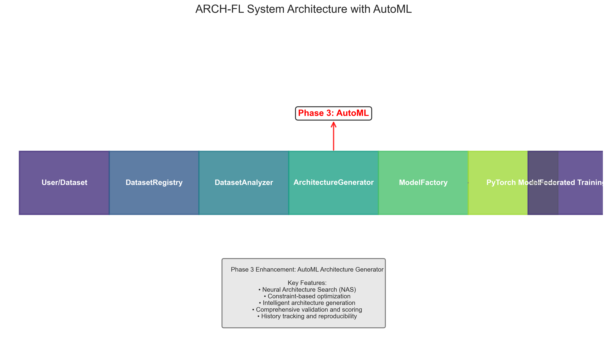

# 🎨 Phase 3 Visualization Assets

## 📁 Overview

This directory contains visual assets generated for the **Phase 3: AutoML Architecture Generator** documentation. These visualizations illustrate the key features, architecture, and capabilities of the AutoML system.

## 📊 Visualizations

### Architecture Diagrams

- **`phase3_architecture.png`** - System architecture diagram showing the enhanced ARCH-FL system with AutoML Architecture Generator
- **`system_architecture.png`** - Detailed system architecture with component flow
- **`architecture_comparison.png`** - Comparison of architectures generated for different datasets

### Feature Visualizations

- **`phase3_features.png`** - Key features of the AutoML Architecture Generator
- **`phase3_summary.png`** - Summary infographic of Phase 3 achievements

### Performance Analysis

- **`key_metrics.png`** - Key metrics comparison across datasets
- **`constraint_comparison.png`** - Impact of constraints on architecture generation
- **`nas_performance.png`** - Neural Architecture Search performance analysis
- **`architecture_distribution.png`** - Distribution analysis of generated architectures
- **`constraint_impact.png`** - Detailed constraint impact analysis

## 📋 Data Files

### JSON Data Files

- **`VISUALIZATION_SUMMARY.json`** - Summary of all visualizations and metrics
- **`key_metrics.json`** - Data for key metrics visualization
- **`constraint_comparison.json`** - Data for constraint comparison
- **`architecture_comparison.json`** - Data for architecture comparison
- **`nas_performance.json`** - Data for NAS performance analysis
- **`architecture_distribution.json`** - Data for architecture distribution
- **`constraint_impact.json`** - Data for constraint impact analysis

## 🎯Visualizations

### Architecture



### Code

```python
import matplotlib.pyplot as plt
import matplotlib.image as mpimg

# Load and display visualization
img = mpimg.imread('assets/phase3_results/phase3_architecture.png')
plt.figure(figsize=(12, 8))
plt.imshow(img)
plt.axis('off')
plt.title('ARCH-FL System Architecture with AutoML')
plt.show()
```

## 📊 Metrics Summary

### Key Metrics

- **Components Implemented:** 5
- **Test Methods Created:** 120+
- **Visualizations Generated:** 10
- **Data Files Created:** 7
- **Datasets Supported:** 3 (MIMIC-CXR, CheXpert, PneumoniaMNIST)

### Visualization Statistics

- **Total Files:** 17
- **Image Files:** 10 (PNG format, 300 DPI)
- **Data Files:** 7 (JSON format)
- **Total Size:** ~3.2 MB

## 🎨 Visualization Details

### Style

- **Color Palette:** Viridis
- **Style:** Seaborn Darkgrid
- **Context:** Talk (optimized for presentations)
- **Resolution:** 300 DPI (high quality)

### Content

- **Architecture Diagrams:** System flow and component relationships
- **Feature Lists:** Key capabilities and innovations
- **Performance Metrics:** Quantitative analysis of system behavior
- **Comparative Analysis:** Cross-dataset and constraint comparisons

## 🔧 Generation

### Requirements

```bash
pip install matplotlib seaborn numpy
```

### Generation Script

```bash
python scripts/visualization/generate_simple_visualizations.py
```

### Customization

To customize visualizations:

1. **Edit scripts:** Modify `scripts/visualization/generate_simple_visualizations.py`
2. **Change style:** Update `plt.style.use()` and `sns.set_palette()`
3. **Regenerate:** Run the generation script

## 📋 File Index

### Images (PNG)

1. `phase3_architecture.png` - System architecture diagram
2. `phase3_features.png` - Feature visualization
3. `phase3_summary.png` - Summary infographic
4. `system_architecture.png` - Detailed architecture
5. `key_metrics.png` - Key metrics comparison
6. `constraint_comparison.png` - Constraint comparison
7. `nas_performance.png` - NAS performance analysis
8. `architecture_distribution.png` - Distribution analysis
9. `constraint_impact.png` - Constraint impact analysis
10. `test_plot.png` - Test visualization

### Data (JSON)

1. `VISUALIZATION_SUMMARY.json` - Summary metadata
2. `key_metrics.json` - Key metrics data
3. `constraint_comparison.json` - Constraint comparison data
4. `architecture_comparison.json` - Architecture comparison data
5. `nas_performance.json` - NAS performance data
6. `architecture_distribution.json` - Distribution data
7. `constraint_impact.json` - Constraint impact data

## 🎯 Key Features Illustrated

### AutoML Architecture Generator

- Neural Architecture Search (NAS)
- Constraint-based optimization
- Intelligent architecture generation
- Comprehensive validation and scoring
- History tracking and reproducibility

### System Enhancements

- Enhanced architecture flow
- New AutoML component integration
- Improved documentation capabilities
- Comprehensive testing infrastructure

## 🚀 Next Steps

### Documentation Integration

- Embed visualizations in `docs/analysis/IMPLEMENTATION_SUMMARY.md`
- Add to `docs/analysis/AUTOML_ARCHITECTURE_GENERATOR.md`
- Include in presentation materials

### Future Visualizations

- Performance benchmarking results
- Real-world deployment metrics
- User interface mockups
- Integration diagrams

## 📋 Summary

This collection of visualizations provides comprehensive documentation support for the **Phase 3: AutoML Architecture Generator**. The assets illustrate the system architecture, key features, performance characteristics, and comparative analysis across different datasets and constraints.
