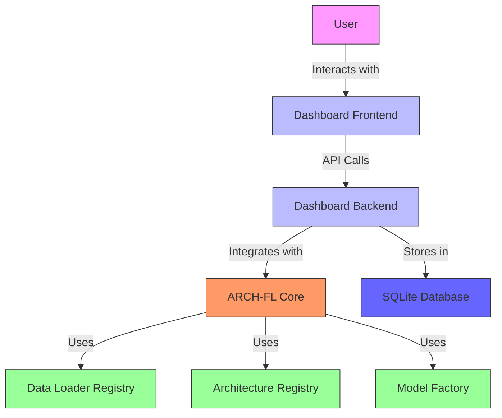
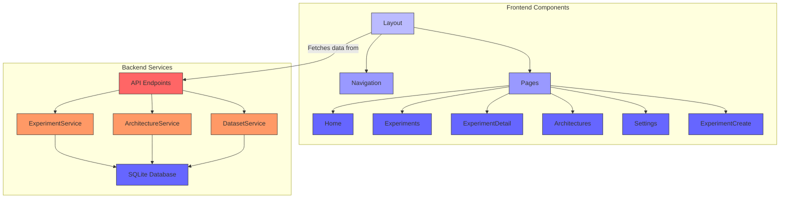
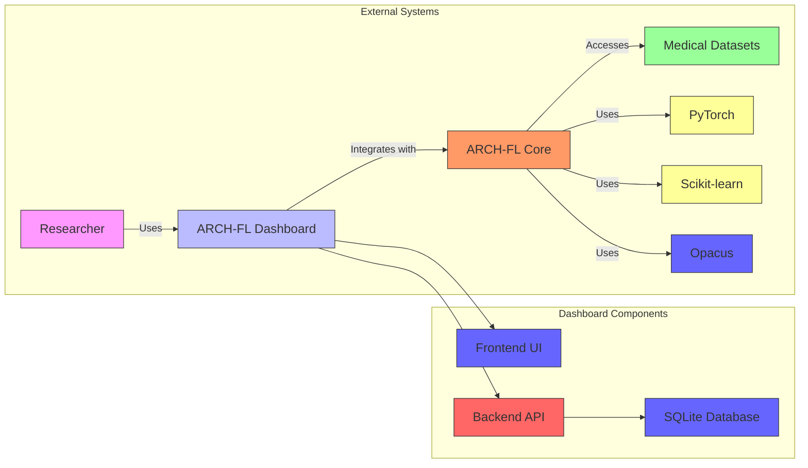
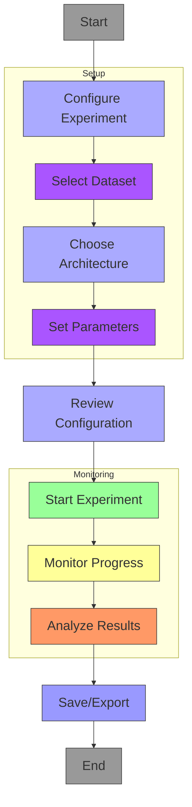
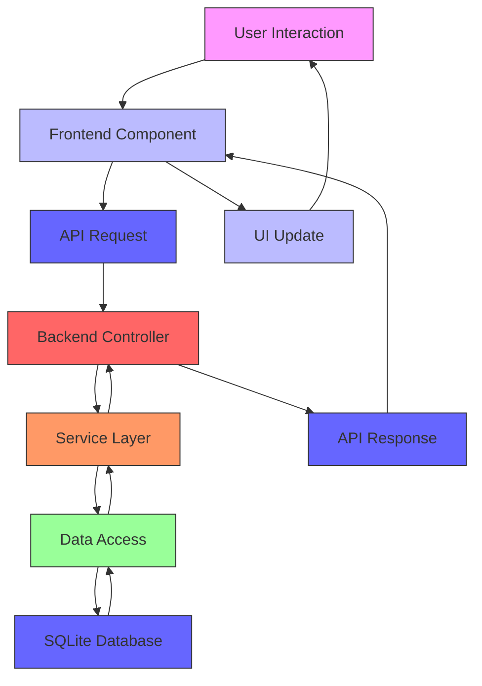
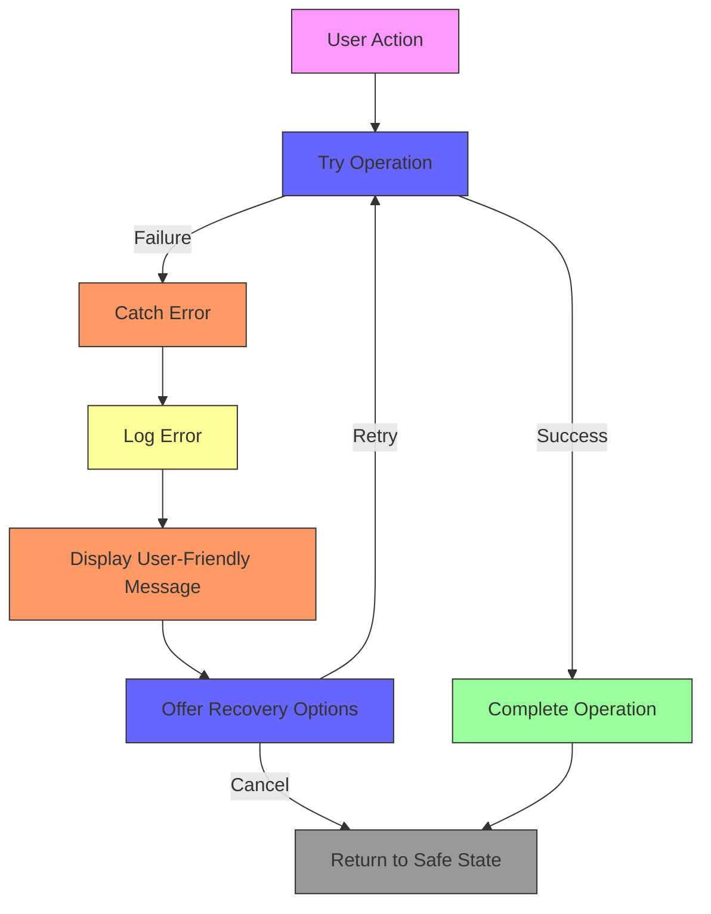
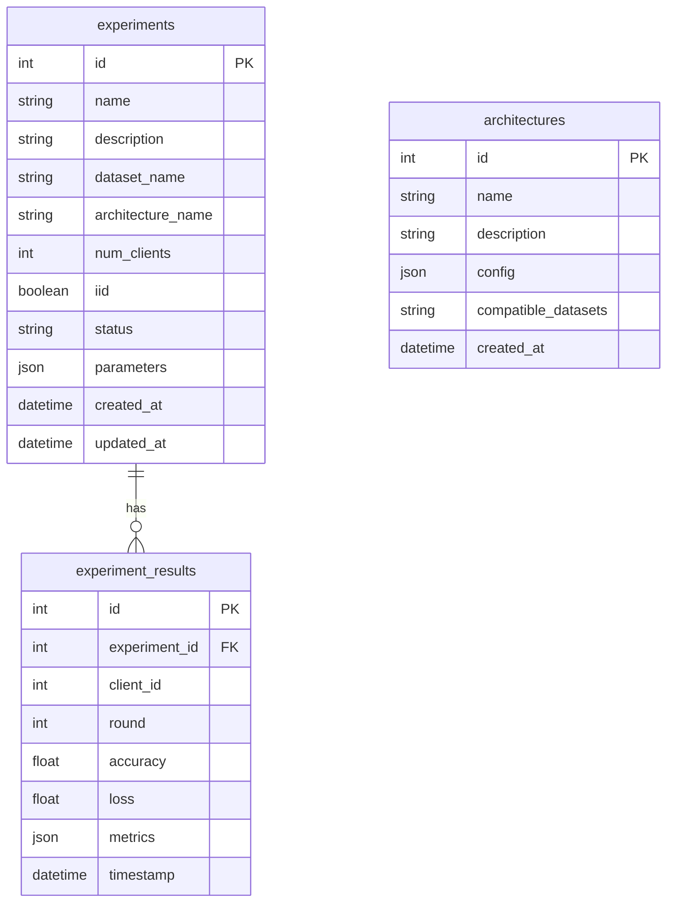

# Chapter 4: System Design

## 4.1 Introduction

This chapter presents the comprehensive system design of the ARCH-FL Dashboard, a web-based interface for the ARCH-FL (Adaptive Resource-Constrained Healthcare Federated Learning) framework. The dashboard provides a user-friendly platform for configuring, monitoring, and analyzing federated learning experiments in medical imaging scenarios.

The system design follows modern software engineering principles, emphasizing modularity, scalability, and user experience. The architecture leverages contemporary web technologies to create an intuitive interface that integrates seamlessly with the underlying ARCH-FL framework.

## 4.2 Requirements

### 4.2.1 Functional Requirements

**FR1: Experiment Management**
- The system shall allow users to create, view, edit, and delete federated learning experiments
- Users shall be able to configure experiment parameters including dataset, architecture, and training settings
- The system shall provide a multi-step wizard for experiment creation

**FR2: Real-time Monitoring**
- The system shall display real-time progress of running experiments
- Users shall be able to view training metrics (accuracy, loss) across federated learning rounds
- The system shall support WebSocket-based updates for live monitoring

**FR3: Architecture Visualization**
- The system shall provide visual representations of model architectures
- Users shall be able to browse and select from available architecture configurations
- The system shall display compatibility information between architectures and datasets

**FR4: Results Analysis**
- The system shall present experiment results in both tabular and graphical formats
- Users shall be able to compare results across multiple experiments
- The system shall support export of results in common formats (CSV, JSON)

**FR5: User Configuration**
- The system shall allow users to customize dashboard settings
- Users shall be able to set preferences for theme, notifications, and display options
- The system shall persist user preferences across sessions

### 4.2.2 Non-Functional Requirements

**NFR1: Performance**
- The dashboard shall respond to user interactions within 200ms for 95% of requests
- API endpoints shall have an average response time of less than 500ms
- The system shall support concurrent monitoring of up to 50 experiments

**NFR2: Usability**
- The system shall follow WCAG 2.1 AA accessibility guidelines
- The user interface shall be responsive and adapt to different screen sizes
- The system shall provide clear error messages and recovery options

**NFR3: Security**
- All API communications shall use HTTPS
- User data shall be protected according to GDPR guidelines
- The system shall implement proper authentication and authorization

**NFR4: Compatibility**
- The system shall support modern web browsers (Chrome, Firefox, Safari, Edge)
- The backend shall be compatible with Python 3.8+
- The frontend shall support Node.js 16+

## 4.3 System Architecture

The ARCH-FL Dashboard follows a client-server architecture with clear separation of concerns between the frontend presentation layer and the backend service layer.

### 4.3.1 High-Level Architecture



**Figure 4.1: High-Level System Architecture**

### 4.3.2 Component Diagram



**Figure 4.2: Component Diagram**

## 4.4 Context Level Diagram

The context level diagram illustrates how the ARCH-FL Dashboard interacts with external entities and systems:



**Figure 4.3: Context Level Diagram**

## 4.5 Input Design

### 4.5.1 User Input Forms

The dashboard provides several input forms for experiment configuration:

**Experiment Creation Form:**
- **Fields:** Experiment name, description, dataset selection, architecture selection
- **Validation:** Required fields marked with asterisks, real-time validation
- **Input Types:** Text input, dropdown selects, radio buttons

**Experiment Configuration Form:**
- **Fields:** Number of clients (2-20), data distribution (IID/Non-IID), training epochs (1-100), batch size (8-256), learning rate (0.0001-0.1)
- **Validation:** Range validation, numeric input constraints
- **Input Types:** Number inputs, radio buttons, sliders

**User Settings Form:**
- **Fields:** Theme selection (light/dark), notification preferences, auto-refresh settings, default values
- **Validation:** None required, all optional
- **Input Types:** Radio buttons, checkboxes, number inputs

### 4.5.2 Input Validation

The system implements comprehensive input validation:

1. **Client-Side Validation:**
   - Required field validation
   - Data type validation
   - Range validation for numeric inputs
   - Real-time feedback with error messages

2. **Server-Side Validation:**
   - Pydantic model validation for API requests
   - Database constraint validation
   - Security validation (input sanitization)

3. **Error Handling:**
   - Clear error messages with specific guidance
   - Visual indicators for invalid fields
   - Graceful degradation for failed operations

### 4.5.3 Example Input Screens

**Experiment Creation - Step 1 (Basic Info):**
```
┌───────────────────────────────────────────────────────┐
│ Create New Experiment                              │
├───────────────────────────────────────────────────────┤
│                                                   │
│ Experiment Name: [PneumoniaMNIST Baseline    ] │
│                                                   │
│ Description:     [Baseline experiment with     ] │
│                  [default parameters           ] │
│                                                   │
│ Dataset:         [▼ PneumoniaMNIST           ] │
│                                                   │
│ Architecture:    [▼ SimpleCNN                ] │
│                                                   │
│                  [Next >]                           │
│                                                   │
└───────────────────────────────────────────────────────┘
```

**Experiment Creation - Step 2 (Configuration):**
```
┌───────────────────────────────────────────────────────┐
│ Experiment Configuration                            │
├───────────────────────────────────────────────────────┤
│                                                   │
│ Number of Clients: [5        ]                      │
│                                                   │
│ Data Distribution: [○ IID] [● Non-IID]           │
│                                                   │
│ Training Epochs:   [10       ]                      │
│                                                   │
│ Batch Size:       [32       ]                      │
│                                                   │
│ Learning Rate:    [0.001    ]                      │
│                                                   │
│                  [< Back] [Next >]                  │
│                                                   │
└───────────────────────────────────────────────────────┘
```

## 4.6 Process Design

### 4.6.1 Experiment Creation Process

```mermaid
graph LR
    A[Start] --> B[Configure Experiment]
    B --> C[Select Dataset]
    C --> D[Choose Architecture]
    D --> E[Set Parameters]
    E --> F[Review Configuration]
    F --> G[Start Experiment]
    G --> H[Monitor Progress]
    H --> I[Analyze Results]
    I --> J[Save/Export]
    J --> K[End]

    style A fill:#999,stroke:#333
    style B fill:#66f,stroke:#333
    style C fill:#66f,stroke:#333
    style D fill:#66f,stroke:#333
    style E fill:#66f,stroke:#333
    style F fill:#66f,stroke:#333
    style G fill:#9f9,stroke:#333
    style H fill:#ff9,stroke:#333
    style I fill:#f96,stroke:#333
    style J fill:#99f,stroke:#333
    style K fill:#999,stroke:#333
```



- V2

**Figure 4.4: Experiment Creation Workflow**
---
### 4.6.2 Data Flow Process



**Figure 4.5: Data Flow Process**

### 4.6.3 Error Handling Process



**Figure 4.6: Error Handling Process**

## 4.7 Database Design

### 4.7.1 Entity-Relationship Diagram

The dashboard uses a SQLite database with the following schema:



**Figure 4.7: Entity-Relationship Diagram**

### 4.7.2 Database Schema SQL

```sql
-- Experiments Table
CREATE TABLE experiments (
    id INTEGER PRIMARY KEY AUTOINCREMENT,
    name TEXT NOT NULL,
    description TEXT,
    dataset_name TEXT NOT NULL,
    architecture_name TEXT NOT NULL,
    num_clients INTEGER NOT NULL,
    iid BOOLEAN NOT NULL,
    status TEXT DEFAULT 'pending',
    parameters JSON NOT NULL,
    created_at TIMESTAMP DEFAULT CURRENT_TIMESTAMP,
    updated_at TIMESTAMP DEFAULT CURRENT_TIMESTAMP
);

-- Experiment Results Table
CREATE TABLE experiment_results (
    id INTEGER PRIMARY KEY AUTOINCREMENT,
    experiment_id INTEGER NOT NULL,
    client_id INTEGER,
    round INTEGER NOT NULL,
    accuracy REAL,
    loss REAL,
    metrics JSON,
    timestamp TIMESTAMP DEFAULT CURRENT_TIMESTAMP,
    FOREIGN KEY (experiment_id) REFERENCES experiments(id)
);

-- Architectures Table
CREATE TABLE architectures (
    id INTEGER PRIMARY KEY AUTOINCREMENT,
    name TEXT UNIQUE NOT NULL,
    description TEXT,
    config JSON NOT NULL,
    compatible_datasets TEXT,
    created_at TIMESTAMP DEFAULT CURRENT_TIMESTAMP
);
```

### 4.7.3 Data Relationships

1. **One-to-Many Relationship:**
   - One experiment can have many results
   - Foreign key: `experiment_results.experiment_id` references `experiments.id`

2. **Data Types:**
   - `INTEGER`: Primary keys, counts, IDs
   - `TEXT`: Names, descriptions, JSON data
   - `REAL`: Metrics (accuracy, loss)
   - `BOOLEAN`: Flags (IID/Non-IID)
   - `TIMESTAMP`: Creation and update times

3. **Indexes:**
   - Primary keys are automatically indexed
   - Foreign keys should be indexed for performance
   - Consider additional indexes on frequently queried columns

## 4.8 Output Design

### 4.8.1 Visual Outputs

**Experiment Dashboard:**
```
┌───────────────────────────────────────────────────────┐
│ Experiment: PneumoniaMNIST Baseline                │
├───────────────────────────────────────────────────────┤
│                                                   │
│ Dataset: PneumoniaMNIST                           │
│ Architecture: SimpleCNN                            │
│ Clients: 5 (Non-IID)                              │
│ Status: ✅ Completed                               │
│                                                   │
│ [Performance Chart]                               │
│   ██████████████████████████████████████████████████  │
│   ████████████████████████████████████████████████████████  │
│                                                   │
│ [Global Model] → [Client 1] → [Client 2] → [Client 3] │
│                    ↑              ↑              ↑     │
│                    └──────────────┴──────────────┘     │
│                                                   │
└───────────────────────────────────────────────────────┘
```

**Experiment List:**
```
┌───────────────────────────────────────────────────────┐
│ Experiments                                        │
├───────────────────────────────────────────────────────┤
│ Name               Dataset          Status    Actions │
├───────────────────────────────────────────────────────┤
│ PneumoniaMNIST     PneumoniaMNIST   ✅ Completed [View] │
│ Baseline           SimpleCNN                       │
│                                                   │
│ MIMIC-CXR Test     MIMIC-CXR        ⏳ Running  [View] │
│                   ResNet18                        │
│                                                   │
│ CheXpert           CheXpert         ❌ Failed   [View] │
│ Experiment         LargeCNN                       │
│                                                   │
│ [New Experiment]                                   │
└───────────────────────────────────────────────────────┘
```

### 4.8.2 Report Generation

**Experiment Report Format:**
```
ARCH-FL Experiment Report
=========================

Experiment Name: PneumoniaMNIST Baseline
Date: 2023-11-15 14:30:00
Status: Completed

Configuration:
- Dataset: PneumoniaMNIST
- Architecture: SimpleCNN
- Clients: 5
- Distribution: Non-IID
- Epochs: 10
- Batch Size: 32
- Learning Rate: 0.001

Results Summary:
- Final Accuracy: 87.5%
- Final Loss: 0.28
- Training Time: 12 minutes
- Best Round: 8 (Accuracy: 88.2%)

Performance Chart:
[Line chart showing accuracy and loss over rounds]

Detailed Results:
Round | Accuracy | Loss
----- | -------- | -----
1     | 65.2%    | 0.87
2     | 72.1%    | 0.72
...   | ...      | ...
10    | 87.5%    | 0.28

Conclusion:
The experiment achieved satisfactory results with the SimpleCNN
architecture on the PneumoniaMNIST dataset. Further optimization
could be explored with different learning rates or more training epochs.
```

### 4.8.3 Export Formats

The dashboard supports multiple export formats:

1. **CSV Format:**
   ```csv
   round,accuracy,loss,timestamp
   1,0.652,0.87,"2023-11-15T14:30:00"
   2,0.721,0.72,"2023-11-15T14:35:00"
   ...
   ```

2. **JSON Format:**
   ```json
   {
     "experiment": {
       "id": 1,
       "name": "PneumoniaMNIST Baseline",
       "dataset": "PneumoniaMNIST",
       "architecture": "SimpleCNN",
       "status": "completed"
     },
     "results": [
       {
         "round": 1,
         "accuracy": 0.652,
         "loss": 0.87,
         "timestamp": "2023-11-15T14:30:00"
       },
       ...
     ]
   }
   ```

3. **PDF Format:**
   - Formatted report with charts and tables
   - Professional layout for academic presentations
   - Includes experiment configuration and results

## 4.9 Chapter Conclusion

This chapter has presented the comprehensive system design of the ARCH-FL Dashboard, covering all aspects from high-level architecture to detailed component specifications. The design follows modern software engineering principles and provides a solid foundation for implementing a user-friendly interface for federated learning experiments.

### Key Design Decisions

1. **Modular Architecture:** The separation of frontend and backend components allows for independent development and scaling.

2. **RESTful API Design:** The use of standard HTTP methods and JSON formatting ensures compatibility and ease of integration.

3. **Responsive UI:** The adoption of modern frontend frameworks and CSS methodologies guarantees a consistent user experience across devices.

4. **Data Validation:** Comprehensive validation at both client and server levels ensures data integrity and security.

5. **Visualization Focus:** The emphasis on data visualization helps users understand complex federated learning processes and results.

### Academic Significance

The system design presented in this chapter demonstrates the application of software engineering principles to a real-world federated learning platform. The architecture addresses the unique challenges of medical imaging federated learning, including:

- **Data Privacy:** The design maintains the privacy-preserving nature of federated learning
- **User Experience:** The interface makes complex ML concepts accessible to researchers
- **Extensibility:** The modular design allows for future enhancements and new features
- **Integration:** Seamless connection with the existing ARCH-FL framework

This design serves as both a practical implementation guide and an academic reference for building federated learning dashboards in healthcare applications.

### Future Enhancements

While the current design addresses the core requirements, several areas could be explored for future development:

1. **Advanced Visualization:** Interactive 3D visualizations of model architectures
2. **Collaborative Features:** Multi-user collaboration on experiments
3. **Automated Analysis:** AI-powered result interpretation and recommendations
4. **Mobile Support:** Native mobile applications for monitoring experiments
5. **Cloud Integration:** Deployment options for cloud-based federated learning

The ARCH-FL Dashboard design provides a robust foundation that can evolve with the growing needs of federated learning research in healthcare.
