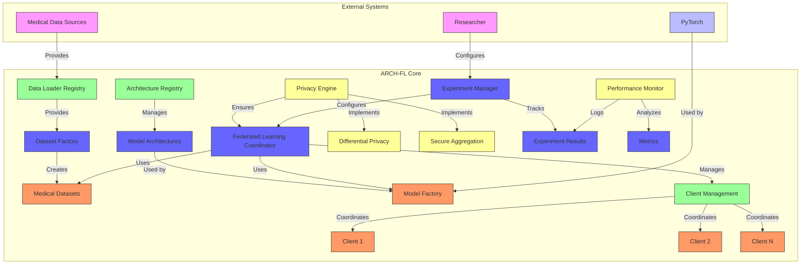

# ARCH-FL Core Architecture

This diagram shows the core architecture of the ARCH-FL framework without the UI components.

## Key Components

### 1. Data Loader Registry
- Manages dataset configurations
- Provides access to medical imaging datasets
- Supports custom dataset registration

### 2. Architecture Registry
- Manages model architecture configurations
- Validates architecture compatibility
- Supports custom architecture registration

### 3. Federated Learning Coordinator
- Orchestrates the federated learning process
- Manages global model aggregation
- Coordinates client communication

### 4. Privacy Engine
- Implements differential privacy
- Ensures secure aggregation
- Protects client data privacy

### 5. Experiment Manager
- Configures and tracks experiments
- Manages experiment lifecycle
- Stores experiment results

### 6. Performance Monitor
- Logs training metrics
- Analyzes experiment performance
- Generates performance reports

## Data Flow

1. **Data Loading:** Medical data sources → Data Loader Registry → Dataset Factory → Medical Datasets
2. **Model Creation:** Architecture Registry → Model Factory → Model Architectures
3. **Experiment Execution:** Experiment Manager → Federated Learning Coordinator → Clients
4. **Privacy Protection:** Privacy Engine → Federated Learning Coordinator (secure aggregation)
5. **Result Tracking:** Clients → Federated Learning Coordinator → Experiment Manager → Performance Monitor

## Integration Points

- **Medical Data Sources:** Provides raw medical imaging data
- **PyTorch:** Used for model training and inference
- **Researcher:** Configures experiments and analyzes results
