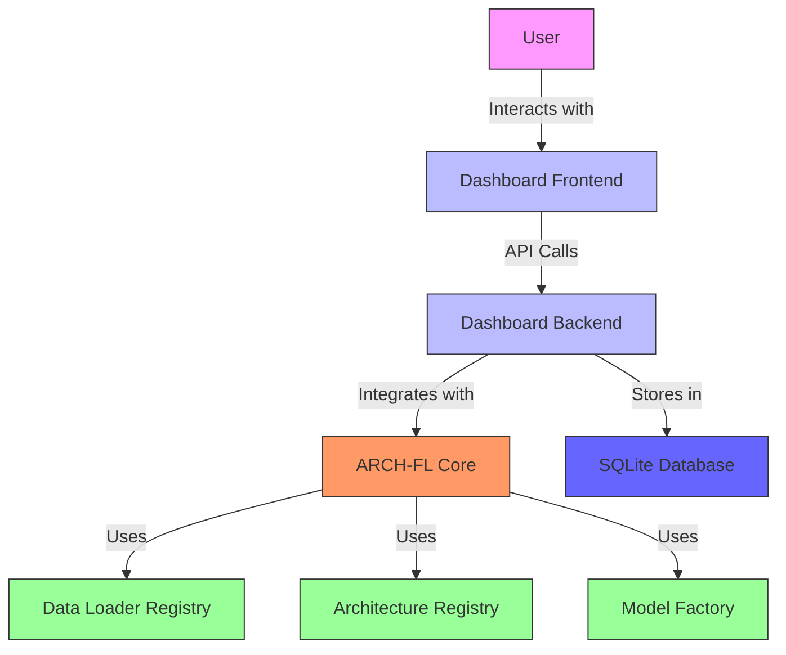

# ARCH-FL Dashboard Architecture

```mermaid
graph TD
    A[User] -->|Interacts with| B[Dashboard Frontend]
    B -->|API Calls| C[Dashboard Backend]
    C -->|Integrates with| D[ARCH-FL Core]
    D -->|Uses| E[Data Loader Registry]
    D -->|Uses| F[Architecture Registry]
    D -->|Uses| G[Model Factory]
    C -->|Stores in| H[SQLite Database]

    style A fill:#f9f,stroke:#333
    style B fill:#bbf,stroke:#333
    style C fill:#bbf,stroke:#333
    style D fill:#f96,stroke:#333
    style E fill:#9f9,stroke:#333
    style F fill:#9f9,stroke:#333
    style G fill:#9f9,stroke:#333
    style H fill:#66f,stroke:#333
```

