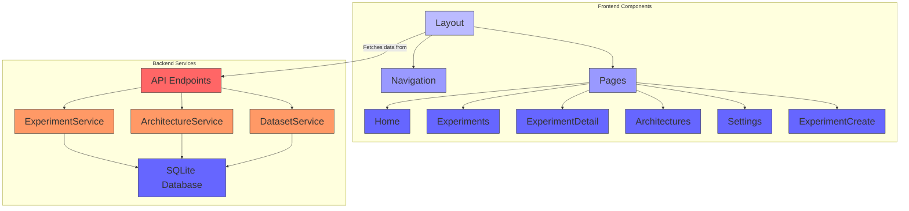

# Dashboard Components

```mermaid
graph TD
    subgraph Frontend Components
        A[Layout] --> B[Navigation]
        A --> C[Pages]
        C --> D[Home]
        C --> E[Experiments]
        C --> F[ExperimentDetail]
        C --> G[Architectures]
        C --> H[Settings]
        C --> I[ExperimentCreate]
    end

    subgraph Backend Services
        J[API Endpoints] --> K[ExperimentService]
        J --> L[ArchitectureService]
        J --> M[DatasetService]
        K --> N[SQLite Database]
        L --> N
        M --> N
    end

    A -->|Fetches data from| J

    style A fill:#bbf,stroke:#333,font-size:28px;
    style B fill:#99f,stroke:#333,font-size:28px;
    style C fill:#99f,stroke:#333,font-size:28px;
    style D fill:#66f,stroke:#333,font-size:28px;
    style E fill:#66f,stroke:#333,font-size:28px;
    style F fill:#66f,stroke:#333,font-size:28px;
    style G fill:#66f,stroke:#333,font-size:28px;
    style H fill:#66f,stroke:#333,font-size:28px;
    style I fill:#66f,stroke:#333,font-size:28px;
    style J fill:#f66,stroke:#333,font-size:28px;
    style K fill:#f96,stroke:#333,font-size:28px;
    style L fill:#f96,stroke:#333,font-size:28px;
    style M fill:#f96,stroke:#333,font-size:28px;
    style N fill:#66f,stroke:#333,font-size:28px;
```

