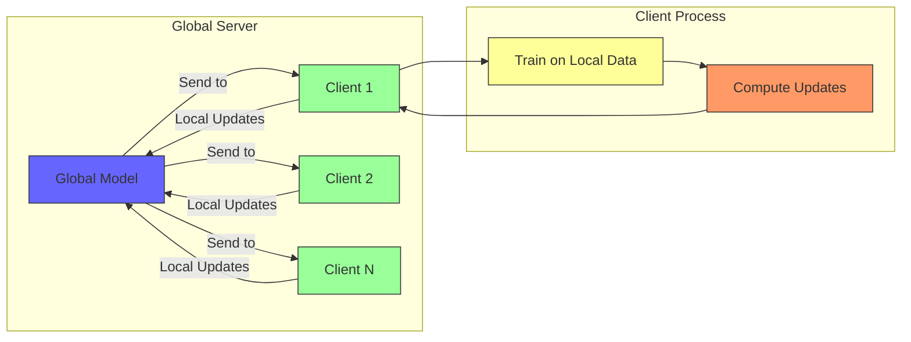

# Federated Learning Process

```mermaid
graph LR
    subgraph Global Server
        A[Global Model] -->|Send to| B[Client 1]
        A -->|Send to| C[Client 2]
        A -->|Send to| D[Client N]
        B -->|Local Updates| A
        C -->|Local Updates| A
        D -->|Local Updates| A
    end

    subgraph Client Process
        B --> E[Train on Local Data]
        E --> F[Compute Updates]
        F --> B
    end

    style A fill:#66f,stroke:#333
    style B fill:#9f9,stroke:#333
    style C fill:#9f9,stroke:#333
    style D fill:#9f9,stroke:#333
    style E fill:#ff9,stroke:#333
    style F fill:#f96,stroke:#333
```

