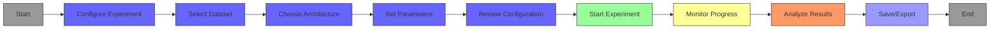

# Experiment Workflow

```mermaid
graph LR
    A[Start] --> B[Configure Experiment]
    B --> C[Select Dataset]
    C --> D[Choose Architecture]
    D --> E[Set Parameters]
    E --> F[Review Configuration]
    F --> G[Start Experiment]
    G --> H[Monitor Progress]
    H --> I[Analyze Results]
    I --> J[Save/Export]
    J --> K[End]

    style A fill:#999,stroke:#333
    style B fill:#66f,stroke:#333
    style C fill:#66f,stroke:#333
    style D fill:#66f,stroke:#333
    style E fill:#66f,stroke:#333
    style F fill:#66f,stroke:#333
    style G fill:#9f9,stroke:#333
    style H fill:#ff9,stroke:#333
    style I fill:#f96,stroke:#333
    style J fill:#99f,stroke:#333
    style K fill:#999,stroke:#333
```

