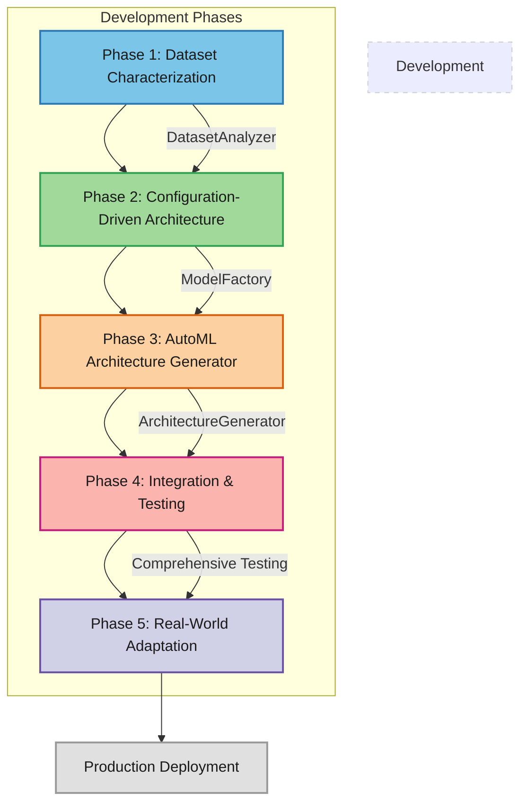

# Development Methodology

The ARCH-FL project follows a **Phased Agile Development Methodology**, combining structured phases with iterative Agile sprints to build a robust, adaptive federated learning framework. The methodology focuses on systematic implementation, comprehensive testing, and continuous integration.

---

## Phases Overview

| **Phase**          | **Key Activities**                                                                 | **Outputs**                          |
|--------------------|-----------------------------------------------------------------------------------|--------------------------------------|
| **Dataset Characterization** | Implement DatasetRegistry and DatasetAnalyzer, analyze medical imaging datasets, extract key characteristics. | Dataset metadata files, analysis documentation. |
| **Configuration-Driven Architecture** | Create ModelFactory, YAML configuration system, dataset-optimized model generation. | YAML configs, ModelFactory implementation. |
| **AutoML Architecture Generator** | Implement ArchitectureGenerator, Neural Architecture Search, constraint-based optimization. | AutoML system, NAS implementation. |
| **Integration & Testing** | Comprehensive testing, performance benchmarking, system validation. | Test suite (120+ tests), performance metrics. |
| **Real-World Adaptation** | Add dataset adapters, performance profiling, user interface enhancements. | Production-ready system, deployment documentation. |

---

## Agile Integration

- **Sprints**: 2-week iterative cycles within each phase
- **Daily Standups**: Team synchronization and progress tracking
- **Continuous Integration**: Automated testing and deployment pipelines
- **Code Reviews**: Peer review for all major changes
- **Tools**:
  - **GitHub Actions**: CI/CD for automated testing and deployment
  - **Pytest**: Unit/integration tests (90%+ coverage)
  - **Codecov**: Test coverage monitoring
  - **Black**: Code formatting
  - **Mypy**: Type checking

---

## Core Components

The development methodology revolves around these key components:

- **DatasetAnalyzer**: Automatic dataset characterization and analysis
- **ModelFactory**: Configuration-driven model creation
- **ArchitectureGenerator**: AutoML architecture generation and optimization
- **Comprehensive Testing**: 120+ test cases covering all components
- **YAML Configuration**: Centralized, version-controlled configurations

---

## Dependencies

Core libraries from `requirements.txt`:
- **Deep Learning**: `torch`, `pytorch-lightning`
- **Data Processing**: `dask`, `pandas`, `medmnist`
- **Privacy**: `opacus`, `tensorflow-privacy`
- **Testing**: `pytest`, `pytest-cov`, `mypy`
- **Visualization**: `matplotlib`, `streamlit`
- **Development**: `black`, `flake8`, `isort`

---

## Example Workflow

1. **Phase 1**: Implement DatasetAnalyzer for MIMIC-CXR → Output: `docs/analysis/mimic_cxr_metadata.json`
2. **Phase 2**: Create ModelFactory with YAML configs → Output: `config/model/medical_cnn.yaml`
3. **Phase 3**: Implement ArchitectureGenerator with NAS → Output: AutoML system with 120+ tests
4. **Phase 4**: Comprehensive testing and validation → Output: Test coverage reports, performance benchmarks
5. **Phase 5**: Production deployment preparation → Output: Deployment documentation, user guides

---

## Development Principles

1. **Configuration-Driven**: All architectures defined in YAML files, not hard-coded
2. **Test-First Approach**: Comprehensive testing before implementation
3. **Modular Design**: Independent, interchangeable components
4. **Continuous Integration**: Automated testing on every commit
5. **Documentation-First**: Complete documentation for all components
6. **Performance Optimization**: Resource-aware architecture generation
7. **Robust Error Handling**: Graceful degradation and comprehensive validation

---

**Note**: For detailed phase-specific implementations, see:
- [`src/data/analyzer.py`](/home/skye/ARCH-FL/src/data/analyzer.py) - Dataset characterization
- [`src/models/model_factory.py`](/home/skye/ARCH-FL/src/models/model_factory.py) - Configuration-driven models
- [`src/models/architecture_generator.py`](/home/skye/ARCH-FL/src/models/architecture_generator.py) - AutoML architecture generation
- [`tests/`](/home/skye/ARCH-FL/tests/) - Comprehensive test suite (120+ test cases)
- [`docs/analysis/`](/home/skye/ARCH-FL/docs/analysis/) - Detailed phase documentation
