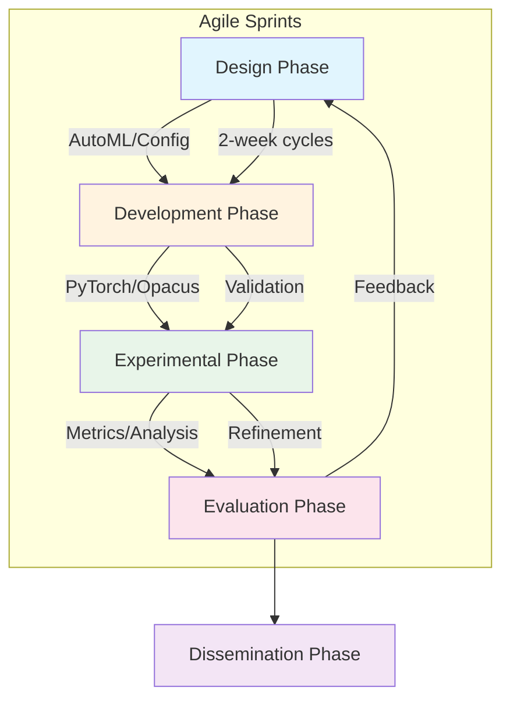

# 3.2 Development Methodology

The ARCH-FL study follows an **Agile-Experimental Development Methodology**, where iterative Agile sprints are interleaved with systematic experiments to validate architectural and privacy-preserving design choices. The process is summarized below:

---

## Phases Overview

| **Phase**          | **Key Activities**                                                                 | **Outputs**                          |
|--------------------|-----------------------------------------------------------------------------------|--------------------------------------|
| **Design**         | AutoML architecture generation, privacy budget planning, data partitioning (IID/non-IID). | YAML configs, architecture blueprints. |
| **Development**    | PyTorch/Opacus implementation, model registration, federated coordinator setup.     | Trained models, experiment metadata.  |
| **Experimental**   | Privacy-utility trade-off tests (ε, δ), non-IID severity analysis, convergence checks. | Metrics, privacy reports, figures.    |
| **Evaluation**     | Statistical analysis, comparison to baselines, dashboard visualization.            | Academic drafts, open-source artifacts. |
| **Dissemination**  | Paper submission, code release (GPL-3.0), dashboard deployment.                     | Published paper, PyPI release.        |

---

## Agile Integration

- **Sprints**: 2-week cycles with **Design → Development → Experiments → Evaluation → Dissemination** feedback loops.
- **Tools**:
  - **MLflow**: Experiment tracking.
  - **Pytest**: Unit/integration tests (90%+ coverage).
  - **GitHub Actions**: CI/CD for reproducibility.

---

## Dependencies

Core libraries from `requirements.txt`:
- **Privacy**: `opacus`, `tensorflow-privacy`.
- **Data**: `dask`, `pandas`, `medmnist`.
- **Training**: `torch`, `pytorch-lightning`.
- **Visualization**: `matplotlib`, `streamlit`.

---

## Example Workflow

1. **Sprint 1**: Design non-IID experiments (`α=0.5`) for PneumoniaMNIST → Output: `config/experiment/non_iid_dp.yaml`.
2. **Sprint 2**: Implement DP-SGD (`ε=1.0`) → Output: `results/checkpoints/model_round_10.pt`.
3. **Sprint 3**: Evaluate results → Output: `docs/paper_submission.pdf`.

---

**Note**: For detailed phase-specific implementations (e.g., `partition_non_iid()`), see:
- [`src/data/partitioning.py`](/home/skye/ARCH-FL/src/data/partitioning.py)
- [`src/models/architecture_generator.py`](/home/skye/ARCH-FL/src/models/architecture_generator.py)
- [`tests/`](/home/skye/ARCH-FL/tests/) (120+ test cases).
